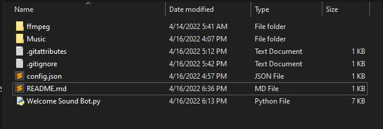

# Discord-Welcome-Sound-Bot
 A discord bot with the sole purpose of playing custom audio clips when specific users join a voice channel. 

# What You Need:
1. Register your discord bot and obtain your bot's token.
2. Clone this repository.
3. Create a config.json file and assign your discord token to the attubute "Token" like this:

    ``` \{
    "Token":"Your Token Here"
    \}
    ```
4. Download ffmpeg from here: [Download ffmpeg-git-full.7z](https://www.gyan.dev/ffmpeg/builds/). Unzip and rename it to "ffmpeg". 
5. Place both the config.json and ffmpeg folder in the same directory as 'Welcome Sound Bot.py'.
6. From here you must edit the User IDs in the top of the 'Welcome Sound Bot.py' to match the users in your server and change the file paths to the sound clips. 

# Picture of Final Folder Structure
